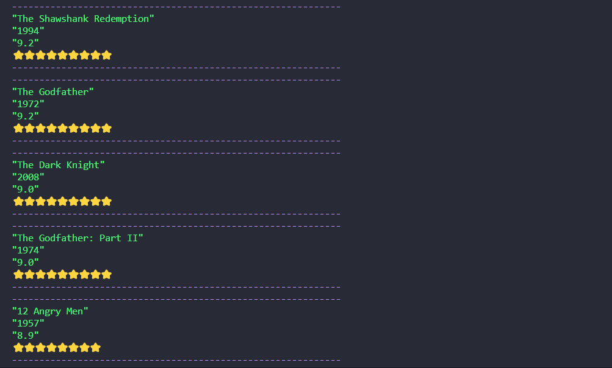
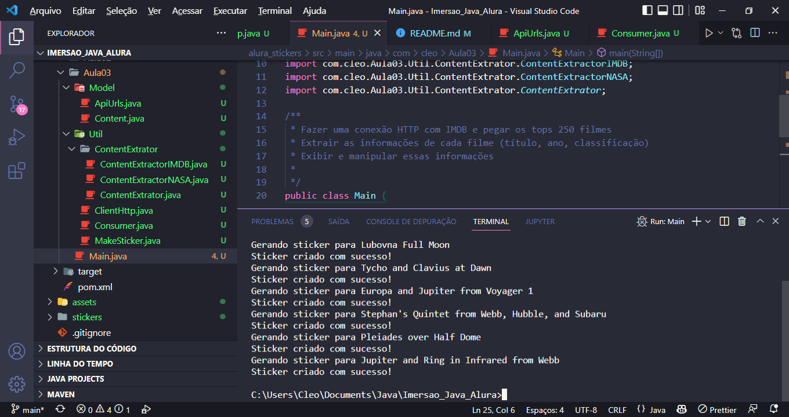

# Imersao_Java_Alura
### Repositório criado para colocar o código da imersão Java da Alura

## ✔️ Técnicas e tecnologias utilizadas

- ``Java 17``
- ``VSCODE``
- ``SpringBoot``
- ``MongoDB``
- ``OpenAPI``

## Bibliotecas externas utilizadas
- jackson-databind

# Primeira Aula

  
Clique para Ver 

## Objetivos:

- 1°  Fazer um get na api do IMBD("No momento está offline")
- 2° Parsear os filmes para um JSON
- 3° Exibir o título, ano e classificação

## Resultado

 
 

# Segunda Aula 

  
Clique para Ver

  
## Objetivos
- ~~Ler a documentação da classe abstrata InputStream.~~
- ~~Centralizar o texto na figurinha.~~
- Fazer um pacote no Whatsapp e/ou Telegram com as suas próprias figurinhas!
- ~~Criar diretório de saída das imagens, se ainda não existir.~~
- ~~Colocar outra fonte como a Comic Sans ou a Impact, a fonte usada em memes.~~
- Colocar uma imagem de você que está fazendo esse curso sorrindo, fazendo joinha!
- ~~Colocar contorno (outline) no texto da imagem.~~
- ~~Tratar as imagens retornadas pela API do IMDB para pegar uma imagem maior ao invés dos thumbnails. Opções: pegar a URL da imagem e remover o trecho mostrado durante a aula ou consumir o endpoint de posters da API do IMDB (mais trabalhoso), tratando o JSON retornado.~~
- ~~Fazer com que o texto da figurinha seja personalizado de acordo com as classificações do IMDB.~~
- Desafio supremo: usar alguma biblioteca de manipulação de imagens como OpenCV pra extrair imagem - principal e contorná-la.
(Faltou explicar melhor)

 

## Resultado

 
 

# Terceira Aula 

  
Clique para Ver

  ## Objetivos
  - Refatorar o código usando POO
  - Fazer um código reutilizável 
  - Adicionar API da Masa
  - Pegar urls de um enum

## Resultado

 
 

# Quarta Aula 

  
Clique para Ver

  ## Objetivos
  - Criar uma API com os metódos (GET, PUT, PATCH, DELETE)
  - Finalizar o CRUD (Create, Read, Update e Delete) para que se possa atualizar e excluir uma linguagem cadastrada;
  - Devolver a listagem ordenada pelo ranking;
  - Criar na sua API um modelo de entidade com nomes diferentes de title e image e criar seu próprio extrator de informações personalizado OU, manter com o nome title e image e traduzir para que seja retornado como título e imagem através do uso de DTO (Data Transfer Object);
  - Retornar o status 201 quando um recurso (linguagem, no nosso caso) for cadastrado através do POST;
  - Desafio supremo: Aplicar modificações parciais no recurso através do método PATCH, por exemplo, modificando o número de votos ou de pessoas que utilizam cada linguagem de programação.

## Resultado

 
 

# Quinta Aula 

  
Clique para Ver

## Objetivos
  - Fazer Deploy da API no Heroku
  - Criar Documentação da API(Swagger OPENAPI)
  - Integrar a API Com o Gerador de Stickers

## Descrição
Decidi me desafiar é criar uma API que além do que foi pedido nos desafios, tivesse uma documentação (ainda não está bem documentada e faltam alguns tratamentos de erros),  também tive a ideia de colocar um gerador de Stickers que recebe o nome, link da imagem e frase desejada na geração, ao final gera o Sticker para o usuário baixar.

## Link Para Acessar A API
[API Imersão Java](https://imersaojava.herokuapp.com/swagger-ui/index.html)

## Resultado 

 
 

# Autor
Cléo Maia Cordeiro
 

